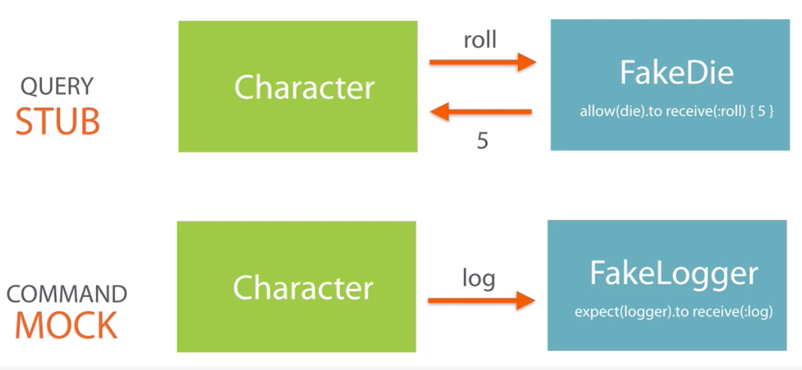

<!-- START doctoc generated TOC please keep comment here to allow auto update -->
<!-- DON'T EDIT THIS SECTION, INSTEAD RE-RUN doctoc TO UPDATE -->
**Table of Contents**  *generated with [DocToc](https://github.com/thlorenz/doctoc)*

- [Test-driven Rails with RSpec, Capybara, and Cucumber](#test-driven-rails-with-rspec-capybara-and-cucumber)
  - [Commonly used commands](#commonly-used-commands)
  - [TDD 101](#tdd-101)
    - [RSpec 101](#rspec-101)
    - [Bowling Game: Kata - Rules](#bowling-game-kata---rules)
    - [Different Types of Tests](#different-types-of-tests)
  - [Acceptance Tests](#acceptance-tests)
    - [Rails Application Setup](#rails-application-setup)
    - [First Feature Spec: Happy Path](#first-feature-spec-happy-path)
    - [First Feature Spec: Sad Path](#first-feature-spec-sad-path)
    - [Page Object Pattern](#page-object-pattern)
    - [Factory Girl (actually Bot)](#factory-girl-actually-bot)
    - [Cucumber](#cucumber)
  - [Controller Tests](#controller-tests)
    - [Controller's Responsibilities](#controllers-responsibilities)
    - [Test New and Show Actions](#test-new-and-show-actions)
    - [Test Create Action](#test-create-action)
    - [Test Index and Edit Actions](#test-index-and-edit-actions)
    - [Test Update and Destroy Actions](#test-update-and-destroy-actions)
    - [Install and Setup Devise gem](#install-and-setup-devise-gem)
    - [Test Authentication](#test-authentication)
    - [Test Authorization](#test-authorization)
  - [Model Tests](#model-tests)
    - [Model's Responsibilities](#models-responsibilities)
    - [Test Validations](#test-validations)
    - [Test Associations](#test-associations)
    - [Test Instance Methods](#test-instance-methods)
    - [Test DB Queries](#test-db-queries)
  - [Testing in Isolation](#testing-in-isolation)
  - [Mocks, Stubs and Dependency Injection](#mocks-stubs-and-dependency-injection)
    - [Non Rails Demo](#non-rails-demo)
  - [Testing Other Cases](#testing-other-cases)
    - [Testing Email](#testing-email)
    - [Testing File Upload](#testing-file-upload)

<!-- END doctoc generated TOC please keep comment here to allow auto update -->

# Test-driven Rails with RSpec, Capybara, and Cucumber

> My notes from Pluralsight [course](https://app.pluralsight.com/library/courses/test-driven-rails-rspec-capybara-cucumber/table-of-contents) on TDD Rails.

## Commonly used commands

| Command        | Description         |
| -------------|-------------|
| `bin/rails s`      | Start rails server |
| `bin/rails c`      | Start rails console |
| `bundle exec rake routes`      | List all routes |
| `bin/rspec`      | Run all Rspec tests      |
| `bin/rspec spec/controllers` | Run only controller tests      |
| `bin/rspec --format=documentation` | Run tests with documentation |
| `bin/cucumber` | Run cucumber tests |
| `bin/rake db:migrate` | Run database migration(s) |

## TDD 101

### RSpec 101

Setup:

```shell
rbenv install 2.3.0
rbenvn local 2.3.0
gem install bundler
touch Gemfile
```

Edit `Gemfile`:

```ruby
# Gemfile
source 'https://rubygems.org'

gem 'rspec'
```

```shell
bundle install
bundle exec rspec --init
```

Output:
```shell
create   .rspec
create   spec/spec_helper.rb
```

`.rspec` contains options for rspec. Add line: `--format documentation` to get nicely formatted test output that matches structure of describe/context/it. eg:

```
Playground
  when there are no children
    is quite boring place
    is empty
```

[Example](spec/playground_spec.rb)

- don't need to `require spec_helper` because this is already specified in `.rspec`
- `describe` defines the example group
- `describe` is a method that takes a string argument to describe what's being tested and a block in which test examples are defined
- `it` method used to define examples
- common context between groups of examples should be organized into `context`, which is alias for `describe` but used for gropuing tests that have common contet
- `describe` can also accept a class name instead of a string

To run tests

```shell
bundle exec rspec spec
```

`expect` method is used to make assertions, general usage with `equal` matcher:

```ruby
expect(actual_value).to equal(expected_value)
```

Rspec ships with many built-in matchers, can also define custom matchers. [Docs](https://relishapp.com/rspec/rspec-expectations/docs/built-in-matchers)

Tests should be structured as: Arrange, Act, Assert, eg:

```ruby
it 'is quite boring place' do
  # Arrange
  playground = Playground.new(0)
  # Act
  mood = playground.mood
  # Assert
  expect(mood).to eq('boring')
end
```

Another useful matcher: `be_empty`, takes everything after `be` prefix, appends question mark to it, and sends it as a message to the object under test, this example expects `playground.empty?` to be truthy:

```ruby
it 'is empty' do
  playground = Playground.new(0)
  expect(playground).to be_empty
end
```

Use `before` method for common setup tasks that should be run before each test within a group (context or describe):

```ruby
require_relative '../lib/playground'

describe Playground do
  context 'when there are no children' do
    before do
      @playground = Playground.new(0)
    end

    it 'is quite boring place' do
      mood = @playground.mood
      expect(mood).to eq('boring')
    end

    it 'is empty' do
      expect(@playground).to be_empty
    end
  end
end
```

Even better than using instance variable is to use `let` method, which takes a symbol, and block. This can replace `before`:

```ruby
require_relative '../lib/playground'

describe Playground do
  context 'when there are no children' do
    let(:playground) { Playground.new(0) }

    it 'is quite boring place' do
      mood = playground.mood
      expect(mood).to eq('boring')
    end

    it 'is empty' do
      expect(playground).to be_empty
    end
  end
end
```

`let`:
- is lazy, block will only be executed first time variable is accessed
- runs block for each example, but only once, caching the result

### Bowling Game: Kata - Rules

Task is to create a class to count and sum scores of bowling game. Store number of knocked down pins for every roll in an array, eg:

```ruby
game = BowlingGame.new

susie_game = [1,4,6,4,5,5,10,0,1,7,3,6,4,10,2,8,6]
peter_game = [0,0,0,0,0,0,0,0,0,0,0,0,0,0,0,0,0,0]

game.rolls(susie_game).score #=> 133
game.rolls(peter_game).score #=> 0
```

**How does scoring work?**

- Game consists of 10 frames.
- In each frame, player gets two rolls to attempt to knock down the 10 pins.
- After two attempts, number of knocked pins are added together to arrive at score for that frame.
- Eg: If in frame 1, player knocks down 1 pin in first roll and 4 pins in second roll - frame score = 1 + 4 = 5.
- Eg: In frame 2, player knocks down 4 pins infirst roll and 5 pins in second roll totalling 9, add to previous frame of 5 to get running total of 14
- BUT also have to consider bonuses
- SPARE: Player knocks down all 10 pins within the two rolls of a frame - then score is 10 for that frame PLUS

Run a particular test:

```shell
bundle exec rspec spec/bowling_game_spec.rb
```

Use `pending` keyword to skip a test:

```ruby
it 'scores a game with spare' do
  pending
  game.pins([4, 6, 5] + [0] * 17)
  expect(game.score).to eq(20)
end
```

### Different Types of Tests

**Unit Tests**

Test classes independently with no other collaborators. Could be Rails model, plain old Ruby object.

**Integration Tests**

Test multiple objects communicating with each other via messages. Could be service object in Rails, using several different ActiveRecord model objects to populate data in db. Slower than unit tests because could be using db.

**Acceptance Tests**

Black box testing, emulate client actions, testing from client perspective. Very slow.

## Acceptance Tests

### Rails Application Setup

Setup rails app, RSpec and Capybara gems.

Instructor using: ruby 2.2.2 and rails 4.2.2. Instead will  use rails 4.2.3 because of [devise bug](https://github.com/plataformatec/devise/issues/4186)

Scaffold rails app, `-T` to skip creating tests because will do in this course:

```shell
gem install rails -v 4.2.3
rails _4.2.2_ new i-rock -T
bundle _1.17.3_ install
bundle _1.17.3_ exec spring binstub --all
cd i-rock
```

Edit [Gemfile](i-rock/Gemfile) to [downgrade sqlite3](https://github.com/sparklemotion/sqlite3-ruby/issues/249#issuecomment-463288367) and use [puma](https://puma.io/). Also specify test gems;

```ruby
gem 'sqlite3', '1.3.13'

# Use Puma as the app server
gem 'puma'

group :development, :test do
  # Call 'byebug' anywhere in the code to stop execution and get a debugger console
  gem 'byebug'

  # Access an IRB console on exception pages or by using <%= console %> in views
  gem 'web-console', '~> 2.0'

  # Spring speeds up development by keeping your application running in the background. Read more: https://github.com/rails/spring
  gem 'spring'

  # More test support
  gem 'spring-commands-rspec'
  gem 'rspec-rails'
  gem 'factory_bot_rails'
end

group :test do
  gem 'capybara'
end
```

Update deps in terminal:

```shell
bundle _1.17.3_
```

Generate some files:

```shell
bin/rails g rspec:install
bundle _1.17.3_ exec spring binstub --all
```

**Feature Spec**

[home_page_spec.rb](i-rock/spec/features/home_page_spec.rb)

- First line in any rails spec is `require 'rails_helper'`
- Use BDD style wording - `feature` instead of `describe` and `scenario` instead of `it`
- Inside `scenario`, use `capybara` methods to click, fill out forms, navigate etc.

```ruby
require 'rails_helper'

feature 'home page' do
  scenario 'welcome message' do
    visit('/')
    expect(page).to have_content('Welcome')
  end
end
```

To run all specs (will fail because no route matches `GET /`)

```shell
bin/rspec
```

**Implement GET / to make test pass**

1. Add welcome route to [routes.rb](i-rock/config/routes.rb)

```ruby
Rails.application.routes.draw do
  root to: 'welcome#index'
end
```

This time when run test, get `uninitialized constant WelcomeController`

2. Create [welcome_controller.rb](i-rock/app/controllers/welcome_controller.rb)

Running test this time get `The action 'index' could not be found for WelcomeController`

3. Define `index` action

```ruby
class WelcomeController < ApplicationController
  def index
  end
end
```

Now get error `ActionView::MissingTemplate:`

4. Define welcome view [index.html.erb](i-rock/app/views/welcome/index.html.erb)

Now get assertion error `expected to find text "Welcome" in ""`

5. Add `Welcome` text to view.

Now test passes.

To see the app so far in browser, start rail server, then open [http://localhost:3000](http://localhost:3000)

```shell
bin/rails s
```

Make welcome page prettier with bootstrap. Add to `Gemfile`:
```ruby
gem 'bootstrap-sass', '~> 3.4.1'
gem 'sassc-rails', '>= 2.1.0'
```

Then add new styles in [main.css.scss](i-rock/app/assets/stylesheets/main.css.scss)

Restart rails server after these changes, refresh browser to see bootstrap styles applied.

### First Feature Spec: Happy Path

Will be using Capybara to navigate pages, fill out forms, etc.

[create_achievement_spec.rb](i-rock/spec/features/create_achievement_spec.rb)

Useful Capybara helpers:

| Helper Example        | Description           |
| ------------- |--------------|
| `visit(/)`      | Navigate to specified url |
| `fill_in('Title', with: 'Read a book')`      | Enter text into a named text input or textarea      |
| `select('Public', from: 'Privacy')` | Select a value from a given dropdown      |
| `check('Featured achievement')` | Check a checkbox, also have `uncheck`      |
| `attach_file('Cover image', "#{Rails.root}/spec/fixtures/cover_image.png")` | Upload a file      |
| `click_on('Create Achievement')` | Click on a button or link with the given label      |

Running tests at this point will fail because haven't created this view yet:

```shell
bin/rspec
```

To implement it, modify [application.html.erb](i-rock/app/views/layouts/application.html.erb), add bootstrap nav markup and link to achievement view:

```ruby
<li class="nav-item">
  <%= link_to 'New Achievement', new_achievement_path %>
</li>
```

Modify [routes.rb](i-rock/config/routes.rb) to define achievement resource:

```ruby
Rails.application.routes.draw do
  resources :achievements, only: %i[new create]
  root to: 'welcome#index'
end
```

Add [achievements_controller.rb](i-rock/app/controllers/achievements_controller.rb)

```ruby
class AchievementsController < ApplicationController
  def new
  end
end
```

Add [achievements template](i-rock/app/views/achievements/new.html.erb) with simple form (will also need corresponding model):

```rails
<%= form_for @achievement do |f| %>
<% end %>
```

Go back to [achievements_controller.rb](i-rock/app/controllers/achievements_controller.rb) and define achievement model:

```ruby
class AchievementsController < ApplicationController
  def new
    @achievement = Achievement.new
  end
end
```

Generate model:

`privacy` property is integer because will be enum in model. Properties that don't have type specified are string.

```shell
$ bin/rails g model achievement title description:text privacy:integer featured:boolean cover_image
Running via Spring preloader in process 22053
  invoke  active_record
  create    db/migrate/20191117202131_create_achievements.rb
  create    app/models/achievement.rb
  invoke    rspec
  create      spec/models/achievement_spec.rb
  invoke      factory_bot
  create        spec/factories/achievements.rb
```

Run migration:

```shell
bin/rake db:migrate
```

Modify [achievements template](i-rock/app/views/achievements/new.html.erb) to use `simple_form`:

```ruby
<%= simple_form_for @achievement do |f| %>
<% end %>
```

Add `simple_form` to [Gemfile](i-rock/Gemfile), then install it and restart server:

```shell
$ bundle _1.17.3_
$ bin/rails g simple_form:install --bootstrap
Running via Spring preloader in process 23196
      create  config/initializers/simple_form.rb
      create  config/initializers/simple_form_bootstrap.rb
       exist  config/locales
      create  config/locales/simple_form.en.yml
      create  lib/templates/erb/scaffold/_form.html.erb
===============================================================================

  Be sure to have a copy of the Bootstrap stylesheet available on your
  application, you can get it on http://getbootstrap.com/.

  Inside your views, use the 'simple_form_for' with the Bootstrap form
  class, '.form-inline', as the following:

    = simple_form_for(@user, html: { class: 'form-inline' }) do |form|

===============================================================================
$ bin/rails s
```

Now go back to [achievements template](i-rock/app/views/achievements/new.html.erb) and define the form:

Now running tests `$ bin/rspec`, gets past filling in Title and fails on next field Description, add it to the template:

```ruby
<%= simple_form_for @achievement do |f| %>
  <%= f.input :title %>
  <%= f.input :description %>
<% end %>
```

Now tests fail because there is no Privacy selection, add this to template, specified `privacies` enum, which will have to define in the model:

```ruby
<%= simple_form_for @achievement do |f| %>
  <%= f.input :title %>
  <%= f.input :description %>
  <%= f.input :privacy, collection: Achievement.privacies %>
<% end %>
```

Add enum for privacy options to [achievement model](i-rock/app/models/achievement.rb)

```ruby
class Achievement < ActiveRecord::Base
  enum privacy: %i[public_access private_access friends_acceess]
end
```

Now test fails on unable to find option `Public`, because the options as defined in enum are lower case and underscored. Solution is to map them in template:

```ruby
<%= simple_form_for @achievement do |f| %>
  <%= f.input :title %>
  <%= f.input :description %>
  <%= f.input :privacy, collection: Hash[Achievement.privacies.map { |k,v| [k.split('_').first.capitalize, k]}] %>
<% end %>
```

Now test fails on unable to find checkbox. Add it, note that simple form knows `featured` is a boolean so automatically renders as checkbox:

```ruby
<%= simple_form_for @achievement do |f| %>
  <%= f.input :title %>
  <%= f.input :description %>
  <%= f.input :privacy, collection: Hash[Achievement.privacies.map { |k,v| [k.split('_').first.capitalize, k]}] %>
  <%= f.input :featured, label: 'Featured achievement' %>
<% end %>
```

Now tests fail on unable to upload file. Create `fixtures` dir in spec and copy some placeholder image there:

```shel
$ mkdir spec/fixtures
```

Modify template to create upload input:

```ruby
<%= simple_form_for @achievement do |f| %>
  <%= f.input :title %>
  <%= f.input :description %>
  <%= f.input :privacy, collection: Hash[Achievement.privacies.map { |k,v| [k.split('_').first.capitalize, k]}] %>
  <%= f.input :featured, label: 'Featured achievement' %>
  <%= f.input :cover_image, as: :file %>
<% end %>
```

Now test fails looking for `Create Achievement` button, add it to template:

```ruby
<%= simple_form_for @achievement do |f| %>
  <%= f.input :title %>
  <%= f.input :description %>
  <%= f.input :privacy, collection: Hash[Achievement.privacies.map { |k,v| [k.split('_').first.capitalize, k]}] %>
  <%= f.input :featured, label: 'Featured achievement' %>
  <%= f.input :cover_image, as: :file %>
  <%= f.submit 'Create Achievement', class: 'btn btn-primary' %>
<% end %>
```

Now test fails on `The action 'create' could not be found for AchievementsController`. Define this in [controller](i-rock/app/controllers/achievements_controller.rb):

```ruby
class AchievementsController < ApplicationController
  def new
    @achievement = Achievement.new
  end

  def create
    @achievement = Achievement.new(achievement_params)
    if @achievement.save
      redirect_to root_url, notice: 'Achievement has been created'
    end
  end

  private

  def achievement_params
    params.require(:achievement).permit(:title, :description, :privacy, :cover_image, :featured)
  end
end
```

But test still failing on not finding success message because app is not currently setup to display flash messages. Fix this in [application layout](i-rock/app/views/layouts/application.html.erb):

```ruby
<% if flash[:notice] %>
  <div class="alert alert-info"><%= flash[:notice] %></div>
<% end %>
<%= yield %>
```

FINALLY, now spec is passing!

Verify in rails console:

```shell
$ bin/rails c
irb(main):001:0> Achievement.last
  Achievement Load (0.2ms)  SELECT  "achievements".* FROM "achievements"  ORDER BY "achievements"."id" DESC LIMIT 1
=> #<Achievement id: 3, title: "my first achievement", description: "some description blah blah", privacy: 0, featured: true, cover_image: "
#<ActionDispatch::Http::UploadedFile:0x007fa0255ce...", created_at: "2019-11-17 22:04:22", updated_at: "2019-11-17 22:04:22">
```

### First Feature Spec: Sad Path

When things go wrong...

Add another scenario to [test](i-rock/spec/features/create_achievement_spec.rb) that attempts to submit empty form and expects error message.

```ruby
scenario 'cannot create achievement with invalid data' do
  visit('/')
  click_on('New Achievement')
  click_on('Create Achievement')

  expect(page).to have_content("can't be blank")
end
```

This will fail because currently there is no validation so all empty form values are allowed.

To fix this, add validation to [achievement model](i-rock/app/models/achievement.rb):

```ruby
class Achievement < ActiveRecord::Base
  validates :title, presence: true
  enum privacy: %i[public_access private_access friends_acceess]
end
```

But now running tests get `ActionView: MissingTemplate`. This is because in [controller create method](i-rock/app/controllers/achievements_controller.rb), only handling the success case. Solution:

```ruby
def create
  @achievement = Achievement.new(achievement_params)
  if @achievement.save
    redirect_to root_url, notice: 'Achievement has been created'
  else
    render :new
  end
end
```

Now test is passing.

What about validating all other fields such as Description, etc? Could add more scenarios to acceptance test but this is a high cost/low value way of testing validations. Recommend to just have one error case at acceptance level, then create more unit tests at model level to verify each individual field validation (covered later in this course).

### Page Object Pattern

[Example PO](i-rock/spec/support/new_achievement_form.rb) | [Example Usage](i-rock/spec/features/create_achievement_with_po_spec.rb)

All the capybara helper methods in test make it "noisy" - makes it difficul to detect test *intention* - what's being tested and why?

Imagine if `create new achievement with valid data` scenario could be simplified:

```ruby
scenario 'create new achievement with valid data' do
  new_achievement_form = NewAchievementForm.new

  # only provide form values test is asserting on,
  # remainder of values can be default
  new_achievement_form.visit_page.fill_in_with(
    title: 'Read a book'
  ).submit

  # test assertions...
end
```

Always return `self` from PO methods so they can be chained.

```ruby
# i-rock/spec/support/new_achievement_form.rb
class NewAchievementForm
  include Capybara::DSL

  def visit_page
    visit('/')
    click_on('New Achievement')
    self
  end

  def fill_in_with(params = {})
    fill_in('Title', with: params.fetch(:title, 'Read a book'))
    fill_in('Description', with: 'Excellent read')
    select('Public', from: 'Privacy')
    check('Featured achievement')
    attach_file('Cover image', "#{Rails.root}/spec/fixtures/cover_image.png")
    self
  end

  def submit
    click_on('Create Achievement')
    self
  end
end

# i-rock/spec/features/create_achievement_with_po_spec.rb
require 'rails_helper'
require_relative '../support/new_achievement_form'

feature 'create new achievement' do
  let(:new_achievement_form) { NewAchievementForm.new }

  scenario 'create new achievement with valid data' do
    new_achievement_form.visit_page.fill_in_with(
      title: 'Read a book'
    ).submit

    expect(page).to have_content('Achievement has been created')
    expect(Achievement.last.title).to eq('Read a book')
  end

  scenario 'cannot create achievement with invalid data' do
    new_achievement_form.visit_page.submit
    expect(page).to have_content("can't be blank")
  end
end
```

### Factory Girl (actually Bot)

Course uses Factory Girl but that's been deprecated in favour of Factory Bot, see this [transition guide](https://github.com/thoughtbot/factory_bot/blob/4-9-0-stable/UPGRADE_FROM_FACTORY_GIRL.md)

Used to prepare Data for tests.

**Commonly used methods**

| Method        | Description           |
| ------------- |-------------|
| create      | Create model and populate in database |
| build      | Create model in memory only      |
| create_list | Create a list of models and populate in database      |
| attributes_for | Create a hash of attributes with default values from the factory |

Add new [spec for achievement page](i-rock/spec/features/achievement_page_spec.rb) that creates an achievement, then visits the page that displays it:

```ruby
require 'rails_helper'

feature 'achievement page' do
  scenario 'achievement public page' do
    # create achievement in database,  so we can visit a page that displays it
    achievement = Achievement.create(title: 'Just did it')
    visit("/achievements/#{achievement.id}")

    expect(page).to have_content('Just did it')
  end
end
```

Test will fail since the `/achievement/:id` route does not yet exist, add it to [routes.rb](i-rock/config/routes.rb) by adding `show` to achievements resource:

```ruby
codeRails.application.routes.draw do
  resources :achievements, only: %i[new create show]
  root to: 'welcome#index'
end
```

Now test fails `The action 'show' could not be found for AchievementsController`. Define `show` action in [achivements_controller.rb](i-rock/app/controllers/achievements_controller.rb)

```ruby
# i-rock/app/controllers/achievements_controller.rb
def show
  @achievement = Achievement.find(params[:id])
end
```

Then add the [template](i-rock/app/views/achievements/show.html.erb)

```ruby
<h1><%= @achievement.title %></h1>
```

Now test passes. Now want to test that description is displayed, need to duplicate some code to create achievement, but this time with description:

```ruby
scenario 'render markdown description' do
  achievement = Achievement.create(description: 'That *was* hard')
  visit("/achievements/#{achievement.id}")

  expect(page).to have_content('<em>was</em>')
end
```

Test won't work because `achievement` can't be created without a title. Use `create!` instead of `create` to see exception:

```
ActiveRecord::RecordInvalid:
  Validation failed: Title can't be blank
```

So are forced to specify a title to make the test work. But that's awkward, could have model with many validated fields but they're not of interest to a particular test.

*Factories* are the solution.

Back when we generated the model `bin/rails g model achievement title description:text privacy:integer featured:boolean cover_image`, a [factory](i-rock/spec/factories/achievements.rb) was auto generated with default values. You can edit these.

To use the factory, replace `Achievement.create` in test with either `FactoryBot.create...` which creates model and populates in the database, or `FactoryBot.build...` which only generates a model in memory.

For acceptance tests use `FactoryBot.create...` because need the model persisted in database to show it in a view. Note can also override defaults when using the factory as in the example below where `title` property is overridden:

```ruby
scenario 'achievement public page' do
  achievement = FactoryBot.create(:achievement, title: 'Just did it')
  visit("/achievements/#{achievement.id}")

  expect(page).to have_content('Just did it')
end
```

Can also define nested factories that inherit from parent factory, for example, add `public_achievement` sub-factory:

```ruby
FactoryBot.define do
  factory :achievement do
    title { 'Title' }
    description { 'description' }
    privacy { Achievement.privacies[:private_access] }
    featured { false }
    cover_image { 'some_file.png' }

    factory :public_achievement do
      privacy Achievement.privacy[:public_access]
    end
  end
end
```

Use sequence feature when populating a field that must be unique for each record (eg: username or email). Example, to make `title` unique:

```ruby
FactoryBot.define do
  factory :achievement do
    sequence(:title) { |n| "Achievement #{n}"}
    description { 'description' }
    privacy { Achievement.privacies[:private_access] }
    featured { false }
    cover_image { 'some_file.png' }
  end

  factory :public_achievement do
    privacy Achievement.privacy[:public_access]
  end
end
```

Another `FactoryBot` method is `create_list` to create several model objects all at once. Add to any test:

```ruby
achievements = FactoryBot.create_list(:achievement, 3)
p achievements
```

Outputs:

```
[#<Achievement id: 2, title: "Achievement 1", description: "description", privacy: 1, featured: false, cover_image: "some_file.png", created
_at: "2019-11-21 00:22:34", updated_at: "2019-11-21 00:22:34">, #<Achievement id: 3, title: "Achievement 2", description: "description", pri
vacy: 1, featured: false, cover_image: "some_file.png", created_at: "2019-11-21 00:22:34", updated_at: "2019-11-21 00:22:34">, #<Achievement
 id: 4, title: "Achievement 3", description: "description", privacy: 1, featured: false, cover_image: "some_file.png", created_at: "2019-11-
21 00:22:34", updated_at: "2019-11-21 00:22:34">]
```

Now implement description rendering as markdown to make other test pass. Modify [show view](i-rock/app/views/achievements/show.html.erb) to display description:

```ruby
<h1><%= @achievement.title %></h1>
<div class="desc">
  <%= @achievement.description %>
</div>
```

Need to add markdown library. Add `gem 'redcarpet'` to [Gemfile](i-rock/Gemfile), then run `bundle _1.17.3_ install`.

Then modify [achievements controller](i-rock/app/controllers/achievements_controller.rb) to apply markdown renderer to description:

```ruby
def show
  @achievement = Achievement.find(params[:id])
  @description = Redcarpet::Markdown.new(Redcarpet::Render::HTML).render(@achievement.description)
end
```

Then modify [show view](i-rock/app/views/achievements/show.html.erb) to display description field from controller:

```ruby
<h1><%= @achievement.title %></h1>
<div class="desc">
  <%= @description %>
</div>
```

Now test passes.

To view results in browser, navigate to [http://localhost:3000/achievements/1](http://localhost:3000/achievements/1) (need to restart server after adding new dep to gemfile).

However, it renders as escaped html, to fix it modify show template `<%= @description.html_safe %>`

BUT that breaks the description test:

```
1) achievement page render markdown description
Failure/Error: expect(page).to have_content('<em>was</em>')
  expected to find text "<em>was</em>" in "I Rock\nHome (current) New Achievement Link\nAchievement 1\nThat was hard"
```

Fix test by expecting css instead of html text - using capybara matcher `have_css`:

```ruby
expect(page).to have_css('em', text: 'was')
```

### Cucumber

Tool to write automated tests in plain English that can be read by anyone, including non technical people. Looks something like:

```
Feature: Create new achievement

  In order to keep and share my achievements
  As a user
  I want to create them

  Scenario: User creates new achievement
    Given I am a logged in user
    When I create new public achievement
    Then anybody can see this achievement online

  Scenario: ...
```

Given/When/Then keywords === Arrange/Act/Assert

To use it, add to gem file in dev/test section: `gem 'spring-commands-cucumber` and in test section: `gem: 'cucumber-rails', require: false` and `gem 'database_cleaner'`, then run:

```shell
bundle _1.17.3_ install
bundle _1.17.3_ exec spring binstub --all # generate `bin/cucumber`
bin/rails g cucumber:install # generate cucumber config files
```

Define a new cucumber test [achievement page](i-rock/features/achievement_page.feature). `And` is the same as another `Given`:

```ruby
Feature: Achievement Page

In order to read others achievements
As a guest user
I want to see public achievement

Scenario: guest user sees public achievement
  Given I am a guest user
  And there is a public achievement
  When I go to the achievement's page
  Then I must see achievement's content
```

To run the test: `bin/cucumber`. Fails on scenario and steps undefined. Error message helpfully provides syntax for how to define steps:

```ruby
# You can implement step definitions for undefined steps with these snippets:

Given("I am a guest user") do
  pending # Write code here that turns the phrase above into concrete actions
end

Given("there is a public achievement") do
  pending # Write code here that turns the phrase above into concrete actions
end

When("I go to the achievement's page") do
  pending # Write code here that turns the phrase above into concrete actions
end

Then("I must see achievement's content") do
  pending # Write code here that turns the phrase above into concrete actions
end
```

Put the steps in [achievements steps](i-rock/features/step_definitions/achievements_steps.rb). To share data between steps, use `@` instance variables.

```ruby
# i-rock/features/step_definitions/achievements_steps.rb

Given('I am a guest user') do
end

Given('there is a public achievement') do
  @achievement = FactoryBot.create(:public_achievement, title: 'I did it')
end

When("I go to the achievement's page") do
  visit(achievement_path(@achievement.id))
end

Then("I must see achievement's content") do
  expect(page).to have_content('I did it')
end
```

Running tests again `bin/cucumber` should pass now.

## Controller Tests

### Controller's Responsibilities

What behaviour needs to be tested? What are things that controllers in typical Rails app do?

- Authenticate and authorize requests
- Handle models
- Create response
  - Render template (usually involves setting some instance variables that template can use)
  - Respond with required format and headers (eg: JSON)
  - redirect to another route

For this module, will focus on *Integration* approach to testing - look at controller as black box - don't know internals, only concerned with providing input data and expecting certain output.

Test that:
- controller action is protected (authentication, authorization)
- particular template is rendered
- expected data is assigned to template

### Test New and Show Actions

Create [achievements controller spec](i-rock/spec/controllers/achievements_controller_spec.rb).

An empty controller spec scaffold should pass:

```ruby
require 'rails_helper'

describe AchievementsController, type: :controller do
end
```

```shell
$ bin/rspec spec/controllers
```

Strictly speaking do not need `type: controller` because of placement in `spec/controllers` folder, Rails already knows what type of test this is.

By convention, first word in spec description is http verb, then action name eg: `GET new`.

Rspec provides helper methods for testing controller methods: `get, post, put, delete`.

Usage is method name, followed by action name, followed by any data it requires.

To verify response, use `render_template` matcher.

`assigns` helper contains all instance variables of the action, pass it a symbol of instance var.

`be_a_new` is a matcher that takes a class name, verifies that assigned object is an instance of that class.

To test `show` action, it needs a record in database, use FactoryBot to create it, put it in `let` method.

When executing get :show, note we pass id to it.

```ruby
# i-rock/spec/controllers/achievements_controller_spec.rb
require 'rails_helper'

describe AchievementsController, type: :controller do
  describe 'GET new' do
    it 'renders :new template' do
      get :new
      expect(response).to render_template(:new)
    end

    it 'assigns new Achievement to @achievement' do
      get :new
      expect(assigns(:achievement)).to be_a_new(Achievement)
    end
  end

  describe 'GET show' do
    let(:achievement) { FactoryBot.create(:public_achievement) }
    it 'renders :show template' do
      get :show, id: achievement.id
      expect(response).to render_template(:show)
    end

    it 'assigns requested achievement to @achievement' do
      get :show, id: achievement.id
      # instance variable populated in `show` action should be the same as what was just created in test
      expect(assigns(:achievement)).to eq(achievement)
    end
  end
end
```

Recall achievements controller `show` method is currently also generating markdown description, refactor this logic to model and modify template accordingly.

```ruby
# i-rock/app/models/achievement.rb
class Achievement < ActiveRecord::Base
  validates :title, presence: true

  enum privacy: %i[public_access private_access friends_acceess]

  def description_html
    Redcarpet::Markdown.new(Redcarpet::Render::HTML).render(description)
  end
end

# i-rock/app/controllers/achievements_controller.rb
class AchievementsController < ApplicationController
  ...
  def show
    @achievement = Achievement.find(params[:id])
    # no longer populating @description instance var here with markdown
  end
  ...
end

# i-rock/app/views/achievements/show.html.erb
<h1><%= @achievement.title %></h1>
<div class="desc">
  <%= @achievement.description_html.html_safe %>
</div>
```

Run all tests `bin/rspec` to make sure refactor hasn't broken anything.

### Test Create Action

Start by creating *test outline*:

```ruby
# i-rock/spec/controllers/achievements_controller_spec.rb
describe AchievementsController, type: :controller do
  ...
  describe 'POST create' do
    it 'redirects to achievements#show'
    it 'creates new achievement in database'
  end
  ...
end
```

Then fill these in. Need to submit `POST` to `:create` action with achievement data.

Use `FactoryBot` to generate achievement data, using `attributes_for` method which creates a hash of attributes with default values from the factory.

Want to expect that response from creating an achievement redirects to `achievement_path`, but this expects an achievment object. See output of `bundle exec rake routes` to understand this:

```shell
$ bundle exec rake routes
        Prefix  Verb URI Pattern                 Controller#Action
   achievements POST /achievements(.:format)     achievements#create
new_achievement GET  /achievements/new(.:format) achievements#new
    achievement GET  /achievements/:id(.:format) achievements#show
           root GET  /                           welcome#index
```

To get access to the achievement object that was just created from the POST action in test, use Rails helper method `assign` to access the instance variable that was created by the controller. And Rspec matcher `redirect_to` to assert on where you expect response was redirected to.

So far we have:

```ruby
# i-rock/spec/controllers/achievements_controller_spec.rb
describe 'POST create' do
  it 'redirects to achievements#show' do
    post :create, achievement: FactoryBot.attributes_for(:public_achievement)
    expect(response).to redirect_to(achievement_path(assigns[:achievement]))
  end

  it 'creates new achievement in database'
end
```

Failing on `'0' is not a valid privacy`. Neex to fix factory:

```ruby
# i-rock/spec/factories/achievements.rb
FactoryBot.define do
  factory :achievement do
    sequence(:title) { |n| "Achievement #{n}"}
    description { 'description' }
    featured { false }
    cover_image { 'some_file.png' }

    factory :public_achievement do
      privacy { :public_access }
    end

    factory :private_achievement do
      privacy { :private_access }
    end
  end
end
```

Now failing on `Expected response to be a redirect to <http://test.host/achievements/1> but was a redirect to <http://test.host/>`

This indicates an error in implementation code, fix it in achievements controller. Currently it redirects to root url after achievement created `redirect_to root_url, notice: 'Achievement has been created'`:

```ruby
# i-rock/app/controllers/achievements_controller.rb
def create
  @achievement = Achievement.new(achievement_params)
  if @achievement.save
    redirect_to achievement_url(@achievement), notice: 'Achievement has been created'
  else
    render :new
  end
end
```

Now test passes.

Implement second test `creates new achievement in database`. Use `expect` with a code block, then verify it has modified the total Achievement count by one. This will compare the count of Achievements in the database before and after the block given to `expect` has run:

```ruby
# i-rock/spec/controllers/achievements_controller_spec.rb
it 'creates new achievement in database' do
  expect {
    post :create, achievement: FactoryBot.attributes_for(:public_achievement)
  }.to change(Achievement, :count).by(1)
end
```

And tests are passing.

But tests need more work, currently only testing create with valid data. Need to also test with invalid data.

Organize the two current POST tests within a `context 'valid data'` block.

Then add another context block for `invalid data`.

Create an achievement with a blank title, which is not allowed, then expect that the new template has been rendered.

Also expect that the count of Achievement records in database is *not* modified when attempt to create an invalid achievement.

```ruby
context 'invalid data' do
  it 'renders :new  template' do
    post :create, achievement: FactoryBot.attributes_for(:public_achievement, title: '')
    expect(response).to render_template(:new)
  end

  it 'does not create new achievement in the database' do
    expect {
      post :create, achievement: FactoryBot.attributes_for(:public_achievement, title: '')
    }.not_to change(Achievement, :count)
  end
end
```

Test could use some refactoring. Usually when using `context`, it means there's some common data in use among the tests. For example, invalid data defined by `FactoryBot.attributes_for(:public_achievement, title: '')` is used twice in tests, this should be pulled out to a `let` block. Also apply similar refactor for valid data:

```ruby
# i-rock/spec/controllers/achievements_controller_spec.rb
describe 'POST create' do
  context 'valid data' do
    let(:valid_data) { FactoryBot.attributes_for(:public_achievement) }

    it 'redirects to achievements#show' do
      post :create, achievement: valid_data
      expect(response).to redirect_to(achievement_path(assigns[:achievement]))
    end

    it 'creates new achievement in database' do
      expect {
        post :create, achievement: valid_data
      }.to change(Achievement, :count).by(1)
    end
  end

  context 'invalid data' do
    let(:invalid_data) { FactoryBot.attributes_for(:public_achievement, title: '') }

    it 'renders :new  template' do
      post :create, achievement: invalid_data
      expect(response).to render_template(:new)
    end

    it 'does not create new achievement in the database' do
      expect {
        post :create, achievement: invalid_data
      }.not_to change(Achievement, :count)
    end
  end
end
```

### Test Index and Edit Actions

Add tests for index action, then implement. Then same for edit. Start with outline of index tests:

```ruby
# i-rock/spec/controllers/achievements_controller_spec.rb
describe 'GET index' do
  it 'renders :index template'
  it 'assigns only public achievements to template'
end
```

Currently there is no `index` route due to this line in router `resources :achievements, only: %i[new create show]`, remove the `only` restriction as now we will have all CRUD operations.

```ruby
# i-rock/config/routes.rb
Rails.application.routes.draw do
  resources :achievements
  root to: 'welcome#index'
end
```

Then test will fail since `index` action does not exist yet - add it to controller, will also need to add template for view. That will be enough to make first test pass. But need more implementation to make second test pass.

```ruby
# i-rock/app/controllers/achievements_controller.rb
def index
  # naive implementation fetches all, but should only be public
  # @achievements = Achievement.all

  # Solution is simple because enums are used
  @achievements = Achievement.public_access
end
```

```ruby
# app/views/achievements/index.html.erb
```

For second test, create both a public and private achievement so can verify public is displayed and private is not displayed. Use matcher `match_array` to compare arrays.

```ruby
# i-rock/spec/controllers/achievements_controller_spec.rb
describe 'GET index' do
  it 'renders :index template' do
    get :index
    expect(response).to render_template(:index)
  end

  it 'assigns only public achievements to template' do
    public_achievement = FactoryBot.create(:public_achievement)
    FactoryBot.create(:private_achievement)
    get :index
    expect(assigns(:achievements)).to match_array([public_achievement])
  end
end
```

Outline for edit tests are similar to show:

```ruby
# i-rock/spec/controllers/achievements_controller_spec.rb
describe 'GET edit' do
  it 'renders :edit template'
  it 'assigns the requested achievement to template'
end
```

Both tests will need some data so define it in `let` block just inside `describe`.

Edit achievement route requires an achievement id as can be seen by rake routes `edit_achievement GET    /achievements/:id/edit(.:format) achievements#edit`

To make edit tests pass will need edit action in controller and edit template `app/views/achievements/edit.html.erb` (can be empty for now)

```ruby
# i-rock/app/controllers/achievements_controller.rb
def edit
  @achievement = Achievement.find(params[:id])
end
```

### Test Update and Destroy Actions

Finish up CRUD operations for achievements. Add outline for `PUT update`. Similar to `POST create`, will need two contexts, for valid and invalid data. Both context's will need an achievement to edit so can define that once in `let` block just inside `describe`.

Note that `put` request needs an id and a hash of data. Will need to implement `update` action in achievements controller.

For update action, don't need to render but do need to redirect to achievement path, which needs an id, can get that from params. This is just enough code to make first test pass, but note it doesn't actually update the achievement yet:

```ruby
# i-rock/app/controllers/achievements_controller.rb
def update
  def update
  redirect_to achievement_path(params[:id])
  end
end
```

To test that the model is updated in database, use active record `reload` method, then expect model's title attribute is updated. This test will fail because `update` method in controller isn't actually updating yet. Fix that:

```ruby
# i-rock/app/controllers/achievements_controller.rb
def update
  @achievement = Achievement.find(params[:id])
  # Updates all the attributes from the passed-in Hash and saves the record. If the object is invalid, the saving will fail and false will be returned.
  redirect_to achievement_path(@achievement) if @achievement.update_attributes(achievement_params)
end
```

For invalid data context, create some invalid data similar to create tests. Expect redirection to edit template, need to handle failure case in controller update method:

```ruby
# i-rock/app/controllers/achievements_controller.rb
def update
  @achievement = Achievement.find(params[:id])
  if @achievement.update_attributes(achievement_params)
    redirect_to achievement_path(@achievement)
  else
    render :edit
  end
end
```

For deleting an achievement, implement `destroy` method in controller

```ruby
def destroy
  Achievement.destroy(params[:id])
  redirect_to achievements_path
end
```

Summary all CRUD operations tested:

```ruby
# i-rock/spec/controllers/achievements_controller_spec.rb
require 'rails_helper'

describe AchievementsController, type: :controller do
  describe 'GET index' do
    it 'renders :index template' do
      get :index
      expect(response).to render_template(:index)
    end
    it 'assigns only public achievements to template' do
      public_achievement = FactoryBot.create(:public_achievement)
      FactoryBot.create(:private_achievement)
      get :index
      expect(assigns(:achievements)).to match_array([public_achievement])
    end
  end

  describe 'GET edit' do
    let(:achievement) { FactoryBot.create(:public_achievement) }

    it 'renders :edit template' do
      get :edit, id: achievement
      expect(response).to render_template(:edit)
    end

    it 'assigns the requested achievement to template' do
      get :edit, id: achievement
      expect(assigns(:achievement)).to eq(achievement)
    end
  end

  describe 'PUT update' do
    let(:achievement) { FactoryBot.create(:public_achievement) }

    context 'valid data' do
      let(:valid_data) { FactoryBot.attributes_for(:public_achievement, title: 'New Title') }

      it 'redirects to achievements#show' do
        put :update, id: achievement, achievement: valid_data
        expect(response).to redirect_to(achievement)
      end

      it 'updates achievement in the database' do
        put :update, id: achievement, achievement: valid_data
        # refresh achievement object with data in database
        achievement.reload
        expect(achievement.title).to eq('New Title')
      end
    end

    context 'invalid data' do
      let(:invalid_data) { FactoryBot.attributes_for(:public_achievement, title: '', description: 'new') }

      it 'renders :edit template' do
        put :update, id: achievement, achievement: invalid_data
        expect(response).to render_template(:edit)
      end

      it 'does not update achievement in the database' do
        put :update, id: achievement, achievement: invalid_data
        achievement.reload
        expect(achievement.description).not_to eq('new')
      end
    end
  end

  describe 'DELETE destroy' do
    let(:achievement) { FactoryBot.create(:public_achievement) }

    it 'redirects to achievements#index' do
      delete :destroy, id: achievement
      expect(response).to redirect_to(achievements_path)
    end

    it 'deletes achievement from database' do
      delete :destroy, id: achievement
      expect(Achievement.exists?(achievement.id)).to be_falsy
    end
  end

  describe 'GET new' do
    it 'renders :new template' do
      get :new
      expect(response).to render_template(:new)
    end

    it 'assigns new Achievement to @achievement' do
      get :new
      expect(assigns(:achievement)).to be_a_new(Achievement)
    end
  end

  describe 'GET show' do
    let(:achievement) { FactoryBot.create(:public_achievement) }
    it 'renders :show template' do
      get :show, id: achievement.id
      expect(response).to render_template(:show)
    end

    it 'assigns requested achievement to @achievement' do
      get :show, id: achievement.id
      # instance variable populated in `show` action should be the same as what was just created in test
      expect(assigns(:achievement)).to eq(achievement)
    end
  end

  describe 'POST create' do
    context 'valid data' do
      let(:valid_data) { FactoryBot.attributes_for(:public_achievement) }

      it 'redirects to achievements#show' do
        post :create, achievement: valid_data
        expect(response).to redirect_to(achievement_path(assigns[:achievement]))
      end

      it 'creates new achievement in database' do
        expect {
          post :create, achievement: valid_data
        }.to change(Achievement, :count).by(1)
      end
    end

    context 'invalid data' do
      let(:invalid_data) { FactoryBot.attributes_for(:public_achievement, title: '') }

      it 'renders :new  template' do
        post :create, achievement: invalid_data
        expect(response).to render_template(:new)
      end

      it 'does not create new achievement in the database' do
        expect {
          post :create, achievement: invalid_data
        }.not_to change(Achievement, :count)
      end
    end
  end
end
```

Run tests with documentation:

```shell
$ bin/rspec --format=documentation spec/controllers/achievements_controller_spec.rb
AchievementsController
  GET index
    renders :index template
    assigns only public achievements to template
  GET edit
    renders :edit template
    assigns the requested achievement to template
  PUT update
    valid data
      redirects to achievements#show
      updates achievement in the database
    invalid data
      renders :edit template
      does not update achievement in the database
  DELETE destroy
    redirects to achievements#index
    deletes achievement from database
  GET new
    renders :new template
    assigns new Achievement to @achievement
  GET show
    renders :show template
    assigns requested achievement to @achievement
  POST create
    valid data
      redirects to achievements#show
      creates new achievement in database
    invalid data
      renders :new  template
      does not create new achievement in the database
```

### Install and Setup Devise gem

Most important responsibility of controller - check if user is allowed to do what they're requesting. Need a user and way to authenticate. To get started with this, will setup `devise` gem with default config.

Add `gem 'devise'` to `Gemfile`, then:

```shell
$ bundle _1.17.3_ install
$ bin/rails g devise:install
Running via Spring preloader in process 67487
      create  config/initializers/devise.rb
      create  config/locales/devise.en.yml
===============================================================================

Some setup you must do manually if you haven't yet:

  1. Ensure you have defined default url options in your environments files. Here
     is an example of default_url_options appropriate for a development environment
     in config/environments/development.rb:

       config.action_mailer.default_url_options = { host: 'localhost', port: 3000 }

     In production, :host should be set to the actual host of your application.

  2. Ensure you have defined root_url to *something* in your config/routes.rb.
     For example:

       root to: "home#index"

  3. Ensure you have flash messages in app/views/layouts/application.html.erb.
     For example:

       <p class="notice"><%= notice %></p>
       <p class="alert"><%= alert %></p>

  4. You can copy Devise views (for customization) to your app by running:

       rails g devise:views
```

Only need to run first instruction for now - add `config.action_mailer.default_url_options = { host: 'localhost', port: 3000 }` at end of `config/environments/development.rb` and `test.rb`

**Generate User**

Use devise to generate user migration and model, then run the migration:

```shell
$ bin/rails g devise user
Running via Spring preloader in process 68061
  invoke  active_record
  create    db/migrate/20191124220841_devise_create_users.rb
  create    app/models/user.rb
  invoke    rspec
  create      spec/models/user_spec.rb
  invoke      factory_bot
  create        spec/factories/users.rb
  insert    app/models/user.rb
  route  devise_for :users
$ bin/rake db:migrate
```

Edit generated [user factory](i-rock/spec/factories/users.rb) to provide default values for required fields:

```ruby
# i-rock/spec/factories/users.rb

```

Devise provides helpers for controller tests, modify [i-rock/spec/rails_helper.rb](i-rock/spec/rails_helper.rb) so its included:

```ruby
# i-rock/spec/rails_helper.rb
...
require 'rspec/rails'
require 'devise'
...
# Devise
config.include Devise::TestHelpers, type: :controller
```

**Routes**

New routes exposed by Devise:

```
                  Prefix Verb   URI Pattern                      Controller#Action
        new_user_session GET    /users/sign_in(.:format)         devise/sessions#new
            user_session POST   /users/sign_in(.:format)         devise/sessions#create
    destroy_user_session DELETE /users/sign_out(.:format)        devise/sessions#destroy
           user_password POST   /users/password(.:format)        devise/passwords#create
       new_user_password GET    /users/password/new(.:format)    devise/passwords#new
      edit_user_password GET    /users/password/edit(.:format)   devise/passwords#edit
                         PATCH  /users/password(.:format)        devise/passwords#update
                         PUT    /users/password(.:format)        devise/passwords#update
cancel_user_registration GET    /users/cancel(.:format)          devise/registrations#cancel
       user_registration POST   /users(.:format)                 devise/registrations#create
   new_user_registration GET    /users/sign_up(.:format)         devise/registrations#new
  edit_user_registration GET    /users/edit(.:format)            devise/registrations#edit
                         PATCH  /users(.:format)                 devise/registrations#update
                         PUT    /users(.:format)                 devise/registrations#update
                         DELETE /users(.:format)                 devise/registrations#destroy
```
### Test Authentication

App will have two roles: Guest user (non authenticated user) and Authenticated user

- Guest User can access `index` and `show` achievements
- Authenticated User has everything Guest has, plus `new` and `create` achievements
- Owner (i.e. author of achievement) can additionally `edit`, `update`, `destroy` achievements that they own

Start with test first approach, adding `describe 'guest user'` to Achievements Controller spec, and move `index` and `show` tests to the guest user block. All the other actions are expected to redirect to login page for a guest user. This is expressed as `expect(response).to redirect_to(new_user_session_url)` where `new_user_session_url` is provided by devise as the login page.

```ruby
# i-rock/spec/controllers/achievements_controller_spec.rb
describe 'guest user' do
  ...
  describe 'GET new' do
    it 'redirects to login page' do
      get :new
      expect(response).to redirect_to(new_user_session_url)
    end
  end
end
```

Test currently fails because it actually goes to index page successfully:

```
Failure/Error: expect(response).to redirect_to(new_user_session_url)
Expected response to be a <redirect>, but was <200>
```

To fix this, need to implement authentication. Edit `AchievementsController`, add `before_action` and specify devise helper to authenticate user, and for which actions it should apply:

```ruby
# i-rock/app/controllers/achievements_controller.rb
class AchievementsController < ApplicationController
  before_action :authenticate_user!, only: [:new]
end
```

Now the guest tests will pass but the other two `GET new` tests will fail, that's ok, will get to them later.

Create tests for all the other actions in guest user block and expect redirect to login page. Add `:create` action to list of authenticated actions in achievements controller to make this pass. Add the other actions as well:

```ruby
# i-rock/app/controllers/achievements_controller.rb
class AchievementsController < ApplicationController
  before_action :authenticate_user!, only: %i[new create edit update destroy]
end
```

The guest suite of tests:

```ruby
# i-rock/spec/controllers/achievements_controller_spec.rb
describe 'guest user' do
  describe 'GET index' do
    it 'renders :index template' do
      get :index
      expect(response).to render_template(:index)
    end
    it 'assigns only public achievements to template' do
      public_achievement = FactoryBot.create(:public_achievement)
      FactoryBot.create(:private_achievement)
      get :index
      expect(assigns(:achievements)).to match_array([public_achievement])
    end
  end

  describe 'GET show' do
    let(:achievement) { FactoryBot.create(:public_achievement) }
    it 'renders :show template' do
      get :show, id: achievement.id
      expect(response).to render_template(:show)
    end

    it 'assigns requested achievement to @achievement' do
      get :show, id: achievement.id
      # instance variable populated in `show` action should be the same as what was just created in test
      expect(assigns(:achievement)).to eq(achievement)
    end
  end

  describe 'GET new' do
    it 'redirects to login page' do
      get :new
      expect(response).to redirect_to(new_user_session_url)
    end
  end

  describe 'POST create' do
    it 'redirects to login page' do
      post :create, achievement: FactoryBot.attributes_for(:public_achievement)
      expect(response).to redirect_to(new_user_session_url)
    end
  end

  describe 'GET edit' do
    it 'redirects to login page' do
      get :edit, id: FactoryBot.create(:public_achievement)
      expect(response).to redirect_to(new_user_session_url)
    end
  end

  describe 'PUT update' do
    it 'redirects to login page' do
      put :update, id: FactoryBot.create(:public_achievement), achievement: FactoryBot.attributes_for(:public_achievement, title: 'New Title')
      expect(response).to redirect_to(new_user_session_url)
    end
  end

  describe 'DELETE destroy' do
    it 'redirects to login page' do
      delete :destroy, id: FactoryBot.create(:public_achievement)
      expect(response).to redirect_to(new_user_session_url)
    end
  end
end
```

### Test Authorization

Just after guest block, add `describe 'authenticated user'` block of tests for achievements controller

All tests in this suite will need a user so create it as usual with `FactoryBot.create(:user)`, but also need this user logged in so use `before` block to ensure user will be logged in before every test.

Use devise helper `sign_in(user)` to log user in.

```ruby
describe 'authenticated user' do
  let(:user) { FactoryBot.create(:user) }
  before do
    sign_in(user)
  end
  # tests go here...
end
```

Authenticated user should have access to index and show actions, same as guest user. Also has `GET new` and `POST create`.

For edit, update and destroy - need two contexts, one for user is owner of the achievement, and another where they are not owner.

When user is not owner, result is similar to guest user -> not allowed to perform the action, similar to guest edit, update and destroy tests, except do not expect edit to new user session url because in this case, there is a logged in user. Instead, user should be redirected to `achievements_path`.

Currently the `is not theowner of the achievement` tests are failing, need to implement ownership in code.

Need to create association between user and achievement -> achievement belongs to user. This requires adding `user_id` to `achievements` table. Generate migration:

```shell
$ bin/rails g migration AddUserToAchievements user:references
```

Generates:

```ruby
# i-rock/db/migrate/20191201204205_add_user_to_achievements.rb
class AddUserToAchievements < ActiveRecord::Migration
  def change
    add_reference :achievements, :user, index: true, foreign_key: true
  end
end
```

Apply migration:

```shell
$ bin/rake db:migrate
```

Now edit the achievement model classe to tell Rails about relationship between achievements and users:

```ruby
# i-rock/app/models/achievement.rb
class Achievement < ActiveRecord::Base
  belongs_to :user
  ...
end
```

Then use this relationship in achievements controller to introduce authorization.

NOTE: For real app, would use [cancan](https://github.com/ryanb/cancan), but for course, will implement a simple `before_action` method. `current_user` is provided by `devise` gem.

Since the new method will define `@achievement` instance variable, it can be deleted from `edit` and `update` actions, and change `destroy` to use the instance variable.

```ruby
# i-rock/app/controllers/achievements_controller.rb
class AchievementsController < ApplicationController
  before_action :authenticate_user!, only: %i[new create edit update destroy]
  before_action :owners_only, only: %i[edit update destroy]
  ...
  def edit
  end

  def update
    if @achievement.update_attributes(achievement_params)
      redirect_to achievement_path(@achievement)
    else
      render :edit
    end
  end

  def destroy
    @achievement.destroy
    redirect_to achievements_path
  end

  private
  ...
  def owners_only
    @achievement = Achievement.find(params[:id])
    redirect_to achievements_path if current_user != @achievement.user
  end
end
```

Now all the authenticated user achievement controller tests are passing.

When user is owner of achievement, use the `GET edit`, `PUT update`, and `DELETE destroy` tests that were we wrote way earlier in course. But move the achievement created by FactoryBot up out of describe and into context level for `user is owner` tests. But indicate that it belongs to the signed in user:

```ruby
# i-rock/spec/controllers/achievements_controller_spec.rb
describe AchievementsController, type: :controller do
  ...
  describe 'authenticated user' do
    let(:user) { FactoryBot.create(:user) }
    before do
      sign_in(user)
    end

    ...

    context 'is the owner of the achievement' do
      let(:achievement) { FactoryBot.create(:public_achievement, user: user) }

      describe 'GET edit' do
        it 'renders :edit template' do
          get :edit, id: achievement
          expect(response).to render_template(:edit)
        end

        it 'assigns the requested achievement to template' do
          get :edit, id: achievement
          expect(assigns(:achievement)).to eq(achievement)
        end
      end

      describe 'PUT update' do
        context 'valid data' do
          let(:valid_data) { FactoryBot.attributes_for(:public_achievement, title: 'New Title') }

          it 'redirects to achievements#show' do
            put :update, id: achievement, achievement: valid_data
            expect(response).to redirect_to(achievement)
          end

          it 'updates achievement in the database' do
            put :update, id: achievement, achievement: valid_data
            # refresh achievement object with data in database
            achievement.reload
            expect(achievement.title).to eq('New Title')
          end
        end

        context 'invalid data' do
          let(:invalid_data) { FactoryBot.attributes_for(:public_achievement, title: '', description: 'new') }

          it 'renders :edit template' do
            put :update, id: achievement, achievement: invalid_data
            expect(response).to render_template(:edit)
          end

          it 'does not update achievement in the database' do
            put :update, id: achievement, achievement: invalid_data
            achievement.reload
            expect(achievement.description).not_to eq('new')
          end
        end
      end

      describe 'DELETE destroy' do
        it 'redirects to achievements#index' do
          delete :destroy, id: achievement
          expect(response).to redirect_to(achievements_path)
        end

        it 'deletes achievement from database' do
          delete :destroy, id: achievement
          expect(Achievement.exists?(achievement.id)).to be_falsy
        end
      end
    end
  end
end
```

Now entire achievements controller tests are passing.

But there is some duplication between guest and authenticated user tests in `GET index` and `GET show`.

Use RSpec `shared_examples` to remove duplication. Cut out the `GET index` and `GET show` describe blocks from `guest user` and place in `shared_examples` at top of test.

Then use these with `it_behaves_like`

```ruby
# i-rock/spec/controllers/achievements_controller_spec.rb
describe AchievementsController, type: :controller do
  shared_examples 'public access to achievements' do
    describe 'GET index' do
      it 'renders :index template' do
        get :index
        expect(response).to render_template(:index)
      end
      it 'assigns only public achievements to template' do
        public_achievement = FactoryBot.create(:public_achievement)
        FactoryBot.create(:private_achievement)
        get :index
        expect(assigns(:achievements)).to match_array([public_achievement])
      end
    end

    describe 'GET show' do
      let(:achievement) { FactoryBot.create(:public_achievement) }
      it 'renders :show template' do
        get :show, id: achievement.id
        expect(response).to render_template(:show)
      end

      it 'assigns requested achievement to @achievement' do
        get :show, id: achievement.id
        # instance variable populated in `show` action should be the same as what was just created in test
        expect(assigns(:achievement)).to eq(achievement)
      end
    end
  end

  describe 'guest user' do
    it_behaves_like 'public access to achievements'
    ...
  end

  describe 'authenticated user' do
    let(:user) { FactoryBot.create(:user) }
    before do
      sign_in(user)
    end

    it_behaves_like 'public access to achievements'
    ...
  end
end
```

But running all tests, getting some failures in acceptance tests because they're trying to create an achievement without being logged in.

Use page object pattern, introduce a login form to fill out.

Since both scenarios need user to have visited login page and filled out the login form, extract this to `before` block. Could also use `background`, which is alias for `before`.

**Aliases:**
- feature === describe
- scenario === it
- background === before

```ruby
# i-rock/spec/support/login_form.rb
class LoginForm
  include Capybara::DSL

  def visit_page
    visit('/users/sign_in')
    self
  end

  def login_as(user)
    fill_in('Email', with: user.email)
    fill_in('Password', with: user.password)
    click_on('Log in')
    self
  end
end

# i-rock/spec/features/create_achievement_with_po_spec.rb
require 'rails_helper'
require_relative '../support/new_achievement_form'
require_relative '../support/login_form'

# frozen_string_literal: true

require 'rails_helper'
require_relative '../support/new_achievement_form'
require_relative '../support/login_form'

feature 'create new achievement' do
  let(:new_achievement_form) { NewAchievementForm.new }
  let(:login_form) { LoginForm.new }
  let(:user) { FactoryBot.create(:user) }

  before do
    login_form.visit_page.login_as(user)
  end

  scenario 'create new achievement with valid data' do
    new_achievement_form.visit_page.fill_in_with(
      title: 'Read a book'
    ).submit

    expect(page).to have_content('Achievement has been created')
    expect(Achievement.last.title).to eq('Read a book')
  end

  scenario 'cannot create achievement with invalid data' do
    new_achievement_form.visit_page.submit
    expect(page).to have_content("can't be blank")
  end
end

```

## Model Tests

Model === ActiveRecord

### Model's Responsibilities

- Validations
- Associations
- DB Queries
- Business logic (debatable)

Example - Achievement Model:

```ruby
# i-rock/app/models/achievement.rb
class Achievement < ActiveRecord::Base
  # Association
  belongs_to :user

  # Validation
  validates :title, presence: true

  enum privacy: %i[public_access private_access friends_acceess]

  # Business logic instance method
  def description_html
    Redcarpet::Markdown.new(Redcarpet::Render::HTML).render(description)
  end
end
```

### Test Validations

Model tests structure:

1. Arrange data
2. Make some action
3. Assert something

When writing validation tests, the action will typically be `modelInstance.valid?`. The `valid?` method validates the model but does not make any database requests.

When expecting validation errors in a test, use the `errors` property of the model. Can also use `valid?` and expect it to be falsy.

```ruby
# i-rock/spec/models/achievement_spec.rb
require 'rails_helper'

RSpec.describe Achievement, type: :model do
  describe 'validations' do
    it 'requires title' do
      achievement = Achievement.new(title: '')
      achievement.valid?
      expect(achievement.errors[:title]).to include("can't be blank")
      # another way to assert without depending on particular message string
      expect(achievement.errors[:title]).not_to be_empty
      # a more general way
      expect(achievement.valid?).to be_falsy
    end
  end
end
```

Suppose we have a new requirement to make `title` unique, but only within the scope of a given user. To test this, first create an achievement for a user and save to db via `FactoryBot.create...`. Then instantiate a new achievement model and check it's `valid?`, expecting result to be falsy.

```ruby
# i-rock/spec/models/achievement_spec.rb
require 'rails_helper'
RSpec.describe Achievement, type: :model do
  describe 'validations' do
    ...
    it 'requires title to be unique for one user' do
      user = FactoryBot.create(:user)
      FactoryBot.create(:public_achievement, title: 'First Achievement', user: user)
      new_achievement = Achievement.new(title: 'First Achievement', user: user)
      expect(new_achievement.valid?).to be_falsy
    end
  end
end
```

Test currently fails because there is no uniqueness validation - implement this in model:

```ruby
# i-rock/app/models/achievement.rb
class Achievement < ActiveRecord::Base
  belongs_to :user
  validates :title, presence: true
  validates :title, uniqueness: true
  ...
end
```

Now test passes, BUT also need to allow different users to use the same title for their achievements:

```ruby
# i-rock/spec/models/achievement_spec.rb
RSpec.describe Achievement, type: :model do
  describe 'validations' do
    ...
    it 'allows different users to have achievements with identical titles' do
      user1 = FactoryBot.create(:user)
      user2 = FactoryBot.create(:user)
      FactoryBot.create(:public_achievement, title: 'First Achievement', user: user1)
      new_achievement = Achievement.new(title: 'First Achievement', user: user2)
      expect(new_achievement.valid?).to be_truthy
    end
  end
end
```

This test fails because the current unique implementation is across ALL records. Fix this in model by implementing a custom validator: (there's actually validation options built into Rails we could use but just to demonstrate use and testing of custom validator)

```ruby
# i-rock/app/models/achievement.rb
class Achievement < ActiveRecord::Base
  belongs_to :user
  validates :title, presence: true
  validate :unique_title_for_one_user

  ...

  private

  def unique_title_for_one_user
    # Search for any other achievement that has the same title as the current instance
    existing_achievement = Achievement.find_by(title: title)
    # Check if user on existing achievement is the same as current instance
    errors.add(:title, "you can't have two achievements with the same title") if existing_achievement && user && existing_achievement.user == user
  end
end
```

Now tests pass.

### Test Associations

Expect achievement to always have an associated user:

```ruby
describe 'associations' do
  it 'belongs to user' do
    achievement = FactoryBot.build(:public_achievement, title: 'Some title', user: nil)
    expect(achievement.valid?).to be_falsy
  end
end
```

Test currently fails because this association is not enforced. Fix it by adding another validation to model `validates :user, presence: true`.

Another test to verify presence of association with user:

```ruby
describe 'associations' do
  it 'belongs to user' do
    achievement = FactoryBot.build(:public_achievement, title: 'Some title', user: nil)
    expect(achievement.valid?).to be_falsy
  end

  it 'has belongs_to user association' do
    # 1 approach - with database
    user = FactoryBot.create(:user)
    achievement = FactoryBot.create(:public_achievement, user: user)
    expect(achievement.user).to eq(user)

    # 2 approach - no database
    u = Achievement.reflect_on_association(:user)
    expect(u.macro).to eq(:belongs_to)
  end
end
```

Model test is currently very large with lots of setup code. Can be reduced with `shoulda-matchers` gem. Add to `:test` section of `Gemfile`: `gem 'shoulda-matchers', require: false`, then bundle install.

Include it in `rails_helper.rb`:

```ruby
require 'rspec/rails'
require 'shoulda/matchers'
require 'devise'
...
Shoulda::Matchers.configure do |config|
  config.integrate do |with|
    with.test_framework :rspec
    with.library :rails
  end
end
```

belongs to test can be replaced with:

```ruby
it { should belong_to(:user) }
```

Validate requires title test can be replaced with:

```ruby
it {should validate_presence_of(:title) }
```

Remove custom uniqueness validation and do it the rails way. Instead of passing `true` to `uniqueness` validation, pass an object with options. One option is `scope`, give it `:user_id`, which tells the validation that it only applies over `user_id`. Can also provide a custom message:

```ruby
# i-rock/app/models/achievement.rb
class Achievement < ActiveRecord::Base
  belongs_to :user
  validates :title, presence: true
  validates :user, presence: true
  validates :title, uniqueness: {
    scope: :user_id,
    message: "you can't have two achievements with the same title "
  }
  ...
end
```

Now the two uniqueness tests can be replaced with:

```ruby
it {
  should validate_uniqueness_of(:title).scoped_to(:user_id).with_message("can't be blank")
                                       .with_message("you can't have two achievements with the same title")
}
```

Finally presence of user test can be replaced with:

```ruby
it { should validate_presence_of(:user) }
```

New and improved model tests:

```ruby
# i-rock/spec/models/achievement_spec.rb
require 'rails_helper'

RSpec.describe Achievement, type: :model do
  describe 'validations' do
    it { should validate_presence_of(:title) }

    it {
      should validate_uniqueness_of(:title).scoped_to(:user_id).with_message("can't be blank")
                                           .with_message("you can't have two achievements with the same title")
    }

    it { should validate_presence_of(:user) }
    it { should belong_to(:user) }
  end
end
```

### Test Instance Methods

Achievement model has one instance method that needs to be tested:

```ruby
# i-rock/app/models/achievement.rb
def description_html
  Redcarpet::Markdown.new(Redcarpet::Render::HTML).render(description)
end
```

`include` is a matcher that checks that checks whether the given string is included in the full string.

```ruby
# i-rock/spec/models/achievement_spec.rb
it 'converts markdown to html' do
  achievement = Achievement.new(description: 'Awesome **thing** I *actually* did')
  expect(achievement.description_html).to include('<strong>thing</strong>')
  expect(achievement.description_html).to include('<em>actually</em>')
end
```

To demonstrate TDD, test for a new method `silly_title` that concatenates achievement title with user's email. Test:

```ruby
# i-rock/spec/models/achievement_spec.rb
it 'has silly title' do
  achievement = Achievement.new(title: 'New Achievement', user: FactoryBot.create(:user, email: 'test@test.com'))
  expect(achievement.silly_title).to eq('New Achievement by test@test.com')
end
```

Running test now will fail on `NoMethodError`, define and implement it in model:

```ruby
# i-rock/app/models/achievement.rb
def silly_title
  "#{title} by #{user.email}"
end
```

**General approach for testing model instance methods**

- Instantiate model object with enough data to exercise instance mthod
- Run the method under test
- Make assertions on the expected value

### Test DB Queries

Another model responsibility - invoke custom queries against database.

eg: Get achievements whose title starts with a specific letter. Implement as class method on model. Test would prepare all data in database, run the method, then assert only expected data is returned.

Test:

```ruby
# i-rock/spec/models/achievement_spec.rb
it 'only fetches achievemetns which title starts from provided letter' do
  user = FactoryBot.create(:user)
  achievement1 = FactoryBot.create(:public_achievement, title: 'Read a book', user: user)
  achievement2 = FactoryBot.create(:public_achievement, title: 'Passed an exam', user: user)
  expect(Achievement.by_letter('R')).to eq([achievement1])
end
```

Test fails because `by_letter` method is not yet defined on model, add it to make tests pass:

```ruby
# i-rock/app/models/achievement.rb
def self.by_letter(letter)
  where('title LIKE ?', "#{letter}%")
end
```

More complicated example, `by_letter` method should sort achievements by user email. Careful because by default, records will be returned sorted by id, which reflects order in which they were created:

```ruby
# i-rock/spec/models/achievement_spec.rb
it 'sorts achievements by user emails' do
  albert = FactoryBot.create(:user, email: 'albert@email.com')
  rob = FactoryBot.create(:user, email: 'rob@email.com')
  achievement1 = FactoryBot.create(:public_achievement, title: 'Read a book', user: rob)
  achievement2 = FactoryBot.create(:public_achievement, title: 'Rocked it', user: albert)
  expect(Achievement.by_letter('R')).to eq([achievement2, achievement1])
end
```

Enhance `by_letter` method to include email sorting, to make test pass:

```ruby
# i-rock/app/models/achievement.rb
def self.by_letter(letter)
  includes(:user).where('title LIKE ?', "#{letter}%").order('users.email')
end
```

## Testing in Isolation

So far we've been testing Rails with acceptance and integration tests. These are easy to write but slow to execute.

## Mocks, Stubs and Dependency Injection

Classes which the object under test communicates with are *dependencies* or collaborators.

eg: Building a game where `Character` class rolls a die from `Die` class. When testing `Character` in *isolation* need to remove dependency on `Die` by replacing it with a fake object `FakeDie` that can be controlled in test.

- replacement === *mocking*
- fake object === *tset double*

**Dependency Injection**

Makes it easy to replace real objecs with fake objects for testing.

Code sample 1 - in instance method `climb`, `Die` dependency is instantiated. This makes it hard to test because `Die` can't easily be replaced.

```ruby
class Character
  def initialize
    @strength = 5
  end

  def climb
    die = Die.new
    die.roll + @strength
  end
end
```

Rewrite `Character` class using *dependency injection*, the `die` dependency is *injected* into `initialize` method. For testing, `Character` object can be instantiated with a fake `die` object that responds to `roll` message:

```ruby
class Character
  def initialize(die)
    @strength = 5
    @die = die
  end

  def climb
    @die.roll + @strength
  end
end
```

Fake object example to test `Character` class:

```ruby
class FakeDie
  def roll
    5
  end
end

character = Character.new(FakeDie.new)
expect(character.roll).to eq(10)
```

**Two Types of Messages on Objects**

1. QUERY - purpose is to get some data returned
2. COMMAND - tell another object to do something, usually has side effect, eg: create new record in db

eg QUERY: when Character class invokes `roll` method on `Die` class and receives a random value in return such as `5`. In this case, the dependency on `Die` is stubbed to return a pre-defined value.

`Die` replaced with `FakeDie`: `allow(die).to receive(:roll) { 5 }`

eg COMMAND: Want to log each `Character` attempt to maintain a history of all rolls for each character. Character does this by sending `log` message to `Logger` class. Doesn't return anything, just telling the logger to do something. Side effect is appending data to a log file.

DO NOT TEST SIDE EFFECT OF ANOTHER OBJECT, just ensure that the message has been sent. Replace actual class `Logger` with a test double `FakeLogger`, then assert expectation that log message was sent with provided data: `expect(logger).to receive(:log)`



**re: AAA (Arrange/Act/Assert)**

With Mocks, expectations (aka assert) are defined *before* acting. Must do this for mocks to work!

Given that `logger` test double. is defined, all tests that don't have expectations for log message

### Non Rails Demo

[Tests](stub-mock-demo/game.rb)

Run tests:

```shell
$ bundle exec rspec game.rb
```

To create test double in RSpec, use `double`:

```ruby
let(:die) { double }
```

Full example in a single file:

```ruby
class Character
  def initialize(strength: 1, die: Die.new, logger: Logger.new)
    @strength = strength
    @die = die
    @logger = logger
  end

  def climb(difficulty: 10)
    roll = die.roll + strength
    logger.log("Climbing check. Difficulty: #{difficulty}. Roll: #{roll}")
    roll >= difficulty
  end

  private

  attr_reader :die, :strength, :logger
end

describe Character do
  describe 'climbing check skill' do
    # Stub dependencies of Character class using test doubles
    let(:die) { double }
    # Parameters to double: Class, and method and what it returns
    let(:logger) { double('Logger', log: nil) }

    # Instantiate object under test, passing in test doubles via dependency injection
    let(:character) { Character.new(strength: 5, die: die, logger: logger) }

    it 'climbs successfully when roll + strength is more than difficulty' do
      # Stub the roll method
      allow(die).to receive(:roll) { 11 }
      expect(character.climb(difficulty: 15)).to be_truthy
    end

    it 'fails successfully when roll + strength is less than difficulty' do
      allow(die).to receive(:roll) { 5 }
      expect(character.climb(difficulty: 15)).to be_falsy
    end

    it 'commands logger to log climb skill check' do
      # Arrange: stub roll method
      allow(die).to receive(:roll) { 7 }
      # Assert: before act when using mocks
      expect(logger).to receive(:log).with('Climbing check. Difficulty: 10. Roll: 12')
      # Act: invoke method under test
      character.climb(difficulty: 10)
    end
  end
end

```

## Testing Other Cases

### Testing Email

Suppose want to send user email every time they successfully create new achievement - how to test this?

Rails has different environments, [test.rb](i-rock/config/environments/test.rb) specifies in test env, do not send emails for real, but store them in a special array, which can be accessed with `ActionMailer::Base.deliveries`. For testing, only need to ensure the email has been appended to this array.

```ruby
# Tell Action Mailer not to deliver emails to the real world.
# The :test delivery method accumulates sent emails in the
# ActionMailer::Base.deliveries array.
config.action_mailer.delivery_method = :test
```

Add email expectations to [create achievement feature test](i-rock/spec/features/create_achievement_with_po_spec.rb):

```ruby
scenario 'create new achievement with valid data' do
  new_achievement_form.visit_page.fill_in_with(
    title: 'Read a book'
  ).submit

  expect(page).to have_content('Achievement has been created')
  expect(Achievement.last.title).to eq('Read a book')
  # expect email to have been sent
  expect(ActionMailer::Base.deliveries.count).to eq(1)
  expect(ActionMailer::Base.deliveries.last.to).to include(user.email)
end
```

To generate email, at terminal run:

```shell
$ bin/rails g mailer UserMailer
Running via Spring preloader in process 9971
  create  app/mailers/user_mailer.rb
  create  app/mailers/application_mailer.rb
  invoke  erb
  create    app/views/user_mailer
  create    app/views/layouts/mailer.text.erb
  create    app/views/layouts/mailer.html.erb
  invoke  rspec
  create    spec/mailers/user_mailer_spec.rb
  create    spec/mailers/previews/user_mailer_preview.rb
```

Notice generaated [user mailer spec](i-rock/spec/mailers/user_mailer_spec.rb), will implement user email feature in TDD way:

```ruby
require 'rails_helper'

RSpec.describe UserMailer, type: :mailer do
  it 'sends achievement created email to author' do
    # This is how mailer is used in production code as well
    email = UserMailer.achievement_created('author@email.com').deliver_now
    expect(email.to).to include('author@email.com')
  end
end

```

Fails on no such method `achievement_created` on `UserMailer`. Implement in [UserMailer](i-rock/app/mailers/user_mailer.rb):

```ruby
class UserMailer < ApplicationMailer
  def achievement_created(email)
    mail to: email
  end
end
```

Also need template

```ruby
# i-rock/app/views/user_mailer/achievement_created.text.erb
# leave empty for now, good enough to get test passing
```

Add another test for user mailer:

```ruby
require 'rails_helper'

RSpec.describe UserMailer, type: :mailer do
  # This is how mailer is used in production code as well
  let(:email) { UserMailer.achievement_created('author@email.com').deliver_now }

  it 'sends achievement created email to author' do
    expect(email.to).to include('author@email.com')
  end

  it 'has correct subject' do
    expect(email.subject).to eq('Congratulations with your new achievement!')
  end
end
```

Fails because default subject is method name `Achievement created`. Implement subject in UserMailer:

```ruby
class UserMailer < ApplicationMailer
  def achievement_created(email)
    mail to: email,
         subject: 'Congratulations with your new achievement!'
  end
end
```

Now subject test passes.

Ensure email body contains link to achievement page:

```ruby
require 'rails_helper'

RSpec.describe UserMailer, type: :mailer do
  # support referencing app route urls in tests
  include Rails.application.routes.url_helpers

  let(:achievement_id) { 1 }
  # This is how mailer is used in production code as well
  let(:email) { UserMailer.achievement_created('author@email.com', achievement_id).deliver_now }

  it 'sends achievement created email to author' do
    expect(email.to).to include('author@email.com')
  end

  it 'has correct subject' do
    expect(email.subject).to eq('Congratulations with your new achievement!')
  end

  it 'has achievement link in body message' do
    expect(email.body.to_s).to include(achievement_url(achievement_id))
  end
end
```

Update UserMailer to accept achievement_id in addition to email:

```ruby
class UserMailer < ApplicationMailer
  def achievement_created(email, achievement_id)
    @achievement_id = achievement_id
    mail to: email,
         subject: 'Congratulations with your new achievement!'
  end
end
```

Fill in body in email template:

```ruby
# i-rock/app/views/user_mailer/achievement_created.text.erb
<%= achievement_url(@achievement_id) %>
```

Now test for url in email body passes.

Going back to [i-rock/spec/features/create_achievement_with_po_spec.rb](i-rock/spec/features/create_achievement_with_po_spec.rb)

Still failing because achievement controller isn't yet using mailer, fix it:

```ruby
# i-rock/app/controllers/achievements_controller.rb
def create
  @achievement = Achievement.new(achievement_params)
  @achievement.user = current_user
  if @achievement.save
    UserMailer.achievement_created(current_user.email, @achievement.id).deliver_now
    # redirect_to root_url, notice: 'Achievement has been created'
    redirect_to achievement_url(@achievement), notice: 'Achievement has been created'
  else
    render :new, notice: "BOO: #{@achievement.errors.full_messages}"
  end
end
```

Now controller test verifying email passes.

Can also test for real in [browser](http://localhost:3000/achievements/new), create new achievement, then server console output:

```
Rendered user_mailer/achievement_created.text.erb within layouts/mailer (1.0ms)

UserMailer#achievement_created: processed outbound mail in 211.8ms

Sent mail to test@example.com (8.6ms)
Date: Thu, 19 Dec 2019 09:32:32 -0500
From: from@example.com
To: test@example.com
Message-ID: <5dfb8a00b6967_17fe3fdf259f61d870949@Danielas-Mac-mini.local.mail>
Subject: Congratulations with your new achievement!
Mime-Version: 1.0
Content-Type: text/plain;
 charset=UTF-8
Content-Transfer-Encoding: 7bit
```

Useful gems for working with email:

* [letter_opener](https://github.com/ryanb/letter_opener)
* [email-spec](https://github.com/email-spec/email-spec)

### Testing File Upload